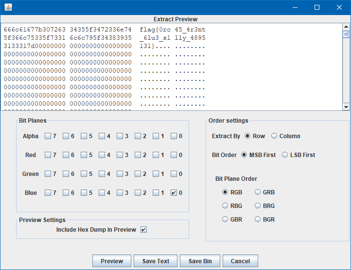

# LSBlue

## Overview
Category: misc  
Points: ???  
Author: wooshi  

## Challenge
> Orca watching is an awesome pastime of mine!

[Isblue.png](lsblue.png)

## Approach
Open up the file in [Stegsolve](https://github.com/eugenekolo/sec-tools/tree/master/stego/stegsolve/stegsolve). Check out all the planes and notice Blue plane looks suspicious:
  
Analyze > Data Extract, check off Blue 0:

### Flag
`flag{0rc45_4r3nt_6lu3_s1lly_4895131}`