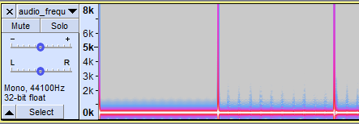

# Problem Name

## Overview
Category: misc  
Points: ???  
Author: wooshi  

## Challenge
> What a mundane song, it's just the same note repeated over and over. But could there perhaps be two different notes?

[audio_frequency_stego.wav](./audio_frequency_stego.wav)

## Approach
I opened the audio in [Audacity](https://www.audacityteam.org/) and looked at the [spectogram](https://manual.audacityteam.org/man/spectrogram_view.html). If you look closely, you can see the first waveform looks fuzzier than the second one (the second one has more spikes).
  
> But could there perhaps be two different notes?  
said the challenge so I decided to assign 0 to the first type of sound and 1 to the second type of sound then got this:
```text
01100110 01101100 01100001 01100111 01111011 01110011 01101100 00110001 01100111 01101000 01110100 01011111 01110000 00110001 01110100 01100011 01101000 01011111 01100011 01101000 00110100 01101110 01100111 00110011 01111101
```
We can decode that with any [binary to ascii](https://www.rapidtables.com/convert/number/binary-to-ascii.html) converter.

### Flag
`flag{sl1ght_p1tch_ch4ng3}`